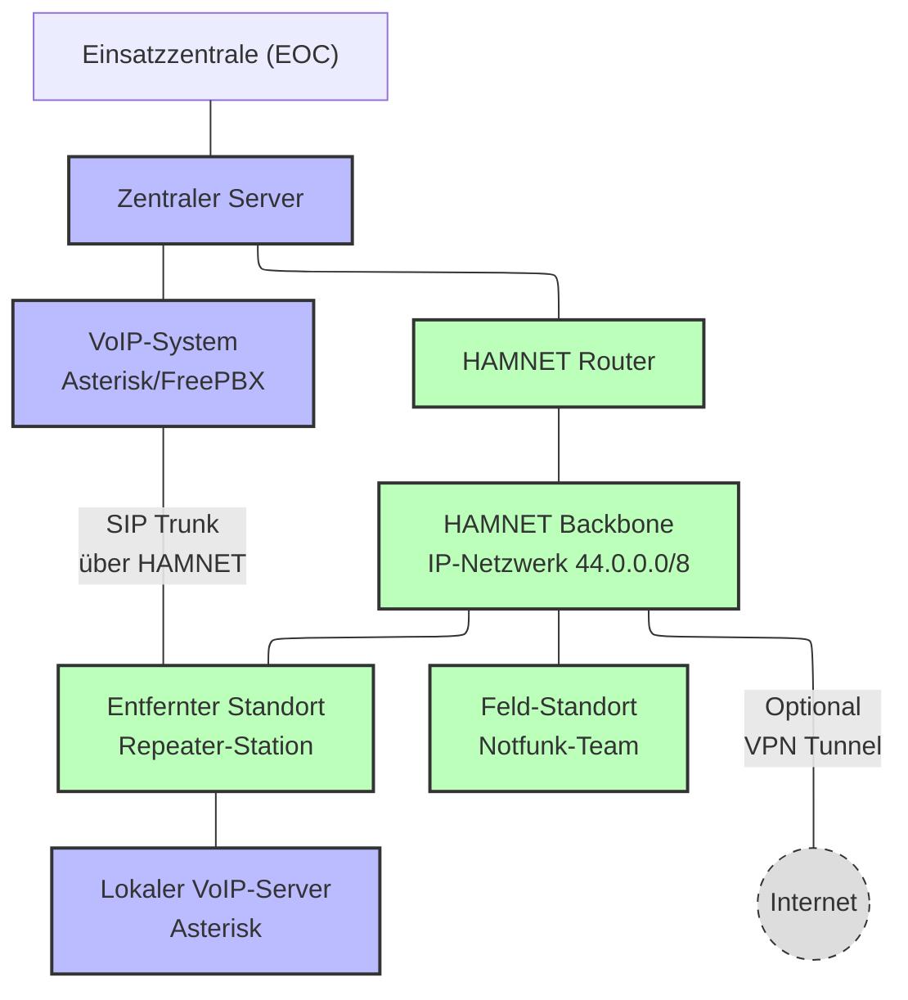
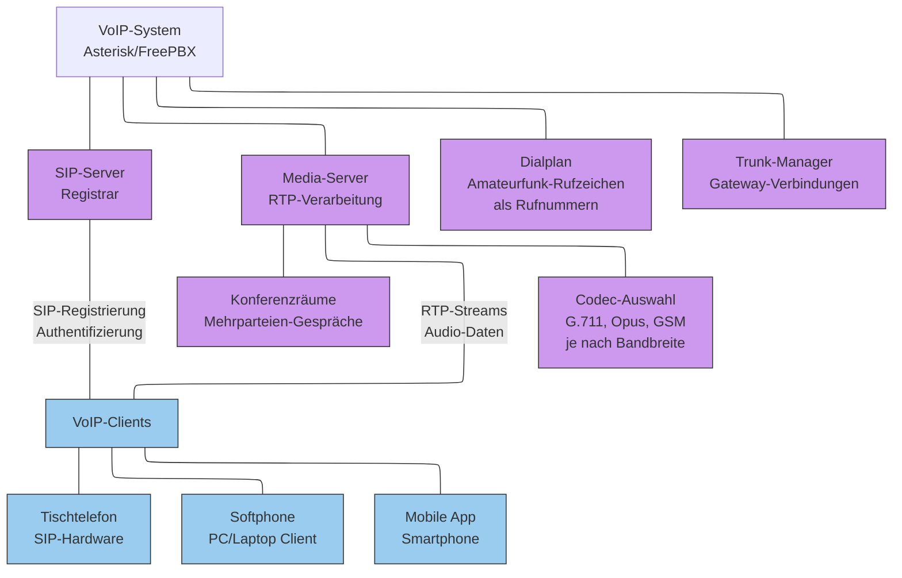
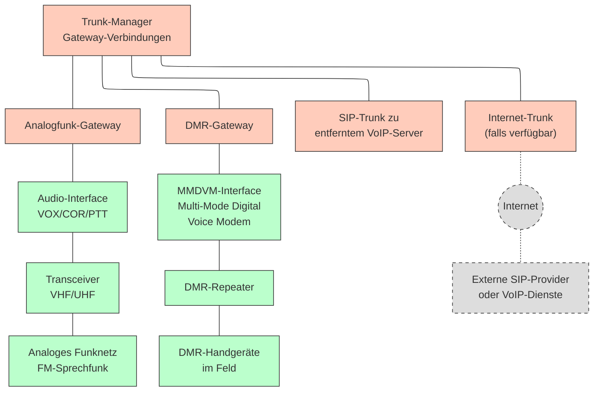
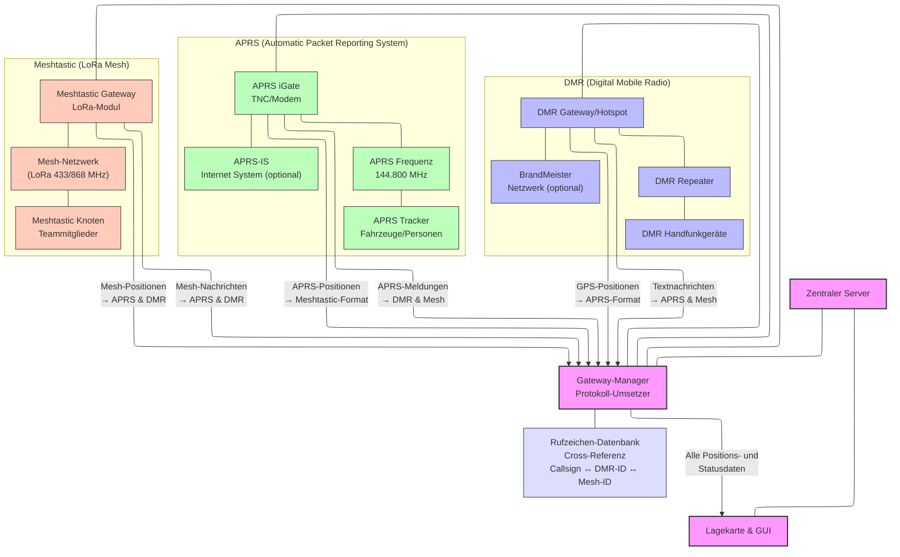
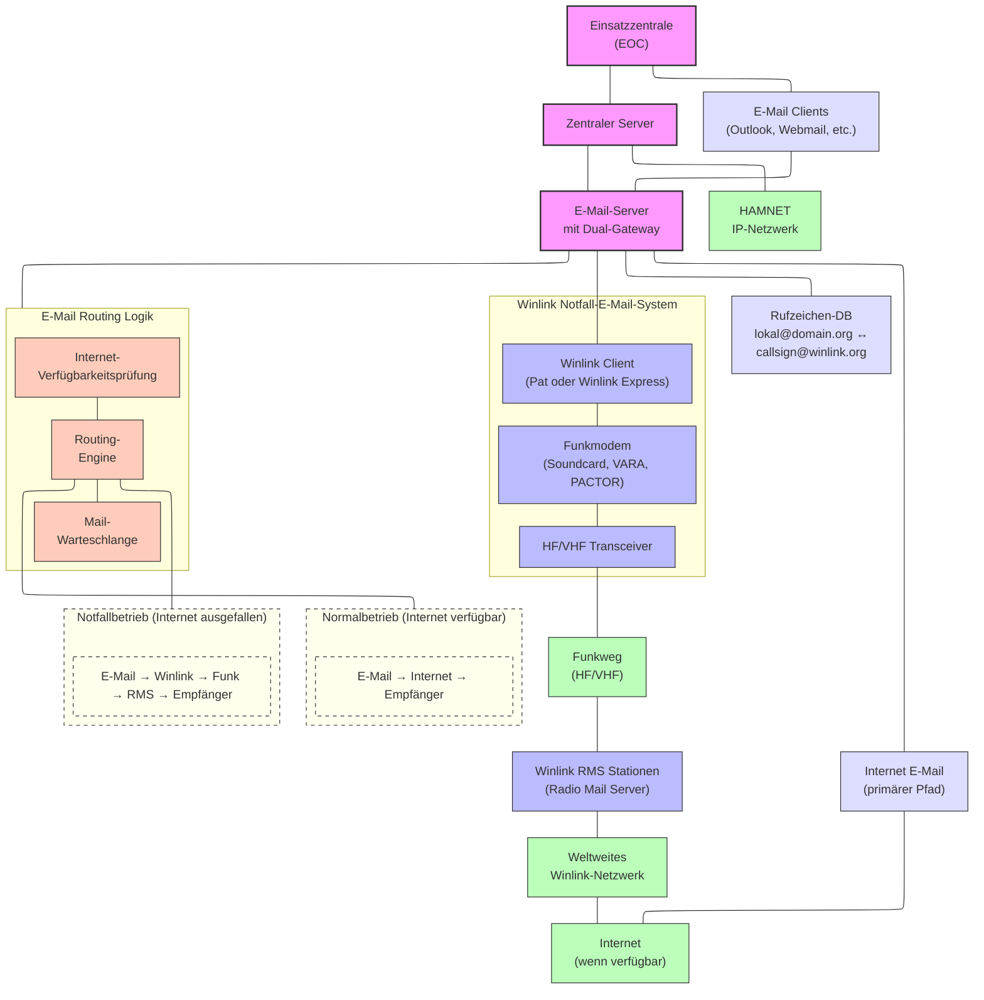
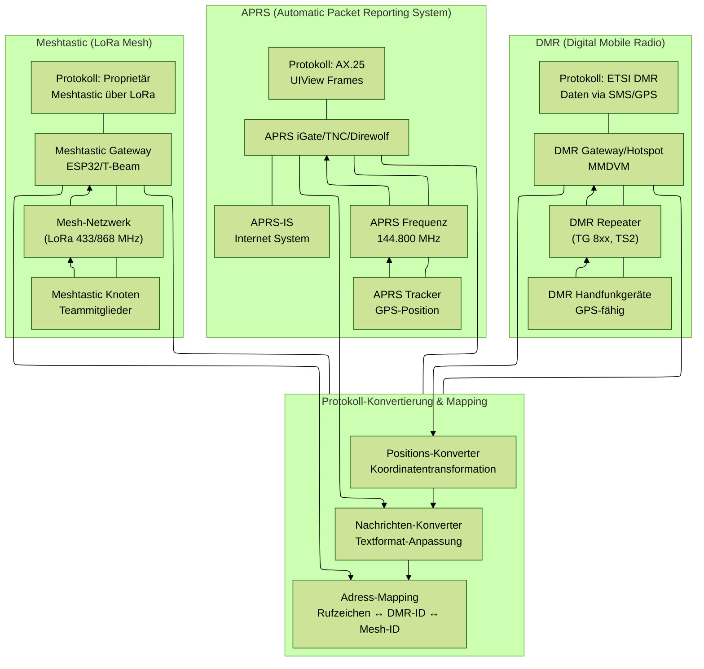

# Swiss-Emergency-Network
# Swiss Amateurfunk Katastrophenkommuniktionssystem

## Inhaltsverzeichnis

1. [Einleitung](#einleitung)
2. [Systemarchitektur und Gesamtübersicht](#systemarchitektur-und-gesamtübersicht)
3. [Integration von HAMNET als IP-Netzwerk (inkl. VoIP-Telefonie)](#integration-von-hamnet-als-ip-netzwerk-inkl-voip-telefonie)
4. [Anbindung von WINLINK für Notfall-E-Mail-Kommunikation](#anbindung-von-winlink-für-notfall-e-mail-kommunikation)
5. [Cross-Kommunikation zwischen DMR, APRS und Meshtastic](#cross-kommunikation-zwischen-dmr-aprs-und-meshtastic)
6. [GUI-Konzept: Kartenansicht und Systemübersichten](#gui-konzept-kartenansicht-und-systemübersichten)
7. [Integration eines E-Mail-Systems (Internet-Relay und Winlink-Fallback)](#integration-eines-e-mail-systems-internet-relay-und-winlink-fallback)
8. [Notstrom- und Ausfallsicherheitskonzept](#notstrom--und-ausfallsicherheitskonzept)
9. [Zusammenfassung](#zusammenfassung)

## Einleitung

Das *Swiss Amateurfunk & Katastrophenmanagement System* ist ein integratives Plattformkonzept, das verschiedene Amateurfunk- und digitale Kommunikationssysteme vernetzt, um im Katastrophenfall eine robuste und unabhängige Kommunikations- und Informationsplattform bereitzustellen. Dieses Dokument beschreibt ausführlich die Architektur und technischen Komponenten der Plattform. 

Ziel ist es, Behörden und Einsatzleitstellen eine zuverlässige Übersicht über Lageinformationen zu bieten und gleichzeitig die Kommunikation über Amateurfunknetze aufrechtzuerhalten, selbst wenn öffentliche Infrastrukturen (Strom, Internet, Telefon) ausfallen. Die Dokumentation berücksichtigt alle vorhandenen Inhalte und Erweiterungen des Projekts und stellt eine einheitliche Struktur sicher.

Sämtliche relevanten Aspekte – von der Einbindung des HAMNET als IP-Rückgrat, über die Nutzung von WINLINK für E-Mail im Notfall, die Kopplung verschiedener Funksysteme (DMR, APRS, Meshtastic), bis hin zum Bedienkonzept der grafischen Oberfläche, der Integration eines E-Mail-Systems mit Fallback sowie dem Notstrom- und Ausfallsicherheitskonzept – werden umfassend dargestellt. Die Sprache ist bewusst sachlich und technisch präzise gehalten, um sowohl von Entwicklern als auch von Behördenvertretern unmittelbar genutzt werden zu können.

Im Folgenden werden zunächst die Gesamtarchitektur und die Hauptkomponenten des Systems vorgestellt. In den darauf aufbauenden Kapiteln werden die einzelnen Teilbereiche im Detail erläutert, inklusive technischer Spezifikationen, Schnittstellen und Empfehlungen.

## Systemarchitektur und Gesamtübersicht


# HAMNET als IP-Netzwerk mit VoIP-Telefonie


Das obige Diagramm zeigt die Integration von HAMNET als IP-Netzwerk mit VoIP-Telefonie für das Swiss Amateurfunk & Katastrophenmanagement System. Folgende Schlüsselkomponenten sind dargestellt:

## Netzwerkstruktur
- **Einsatzzentrale (EOC)** mit dem zentralen Server, der alle Dienste koordiniert
- **HAMNET Router** als Zugang zum HAMNET-Netzwerk über redundante 5 GHz-Links
- **HAMNET Backbone-Knoten** (A, B, C, D) an strategischen Standorten (z.B. Berggipfel, hohe Gebäude)
- Richtfunkverbindungen zwischen den HAMNET-Knoten mit vermaschter Struktur für Redundanz

## VoIP-Integration
- **VoIP-Telefonie-Server** (z.B. Asterisk) eingebunden in den zentralen Server
- Verschiedene **VoIP-Clients**: Festtelefone und mobile Geräte mit SIP/RTP-Protokoll
- **Ferngesteuerter Transceiver** für Anbindung an analoge Funknetze via VoIP

## Erweiterungen

Das System erlaubt die hochbreitbandige Kommunikation zwischen den Knoten unabhängig vom öffentlichen Internet und ermöglicht Sprach-, Daten- und Messaging-Dienste über das HAMNET-Netzwerk. Dank der Redundanz der Verbindungen bietet es hohe Ausfallsicherheit.

Die Systemarchitektur der *Swiss Amateurfunk & Katastrophenmanagement System* kombiniert mehrere Kommunikationsnetze und Dienste zu einer integrierten Plattform. Zentraler Knoten des Systems ist eine **zentrale Plattform-Server**-Komponente, auf der die Integrations-Software läuft. Dieser Server verbindet sich einerseits mit den Amateurfunknetzen (über verschiedene Gateways und Schnittstellen) und andererseits mit der Bedienoberfläche (GUI) für die Nutzer sowie ggf. mit externen Netzen (Internet oder behördliche Netzwerke).

Die Architektur ist so ausgelegt, dass sie ohne öffentliche Infrastruktur auskommen kann, aber vorhandene Internetverbindungen nutzt, solange sie verfügbar sind, um Funktionalität zu erweitern (z.B. aktuelle Kartendaten, Synchronisation mit externen Datenbanken). Sämtliche Komponenten des lokalen Systems sind auf **Autarkie** ausgelegt -- also eine Betriebsfähigkeit unabhängig von Stromnetz und Internet. Dies ist essentiell, da im Katastrophenfall behördliche oder öffentliche Netze gestört sein können.

### Systemkomponenten

Die zentrale Plattform (Server mit spezieller Software) ist das Herzstück und verbindet sich über IP mit dem **HAMNET** (dem hochbreitbandigen Amateurfunk-Netzwerk) und über verschiedene Gateways mit den Funksystemen **DMR**, **APRS** und **Meshtastic**. 

Ein angebundenes **E-Mail-System** ermöglicht den Versand und Empfang von E-Mails. Die **Benutzer-GUI** (Karten & Übersichten) wird typischerweise in einer Einsatzzentrale (z.B. bei einer Behörde) genutzt und greift über Web-Technologien auf den Server zu. Für die Notfall-E-Mail-Kommunikation ist ein **Winlink-Gateway** per Funk (UKW oder Kurzwelle) angebunden, das E-Mails via HF/VHF versenden kann. 

Alle diese Komponenten werden durch eine **Notstromversorgung** (Batterie, Generator) gepuffert, sodass ein Betrieb auch bei Stromausfall sichergestellt ist. Externe Kommunikationsnetze wie das weltweite **DMR-Netz**, das **APRS-Internetnetz (APRS-IS)**, andere **Meshtastic Mesh-Netze** sowie das öffentliche **Internet** können – wo verfügbar – über definierte Schnittstellen (z.B. via Hamnet oder optionale Tunnel) kontaktiert werden.

Die Architektur gewährleistet somit sowohl *Integration* (Zusammenschaltung der unterschiedlichen Systeme) als auch *Redundanz* (alternative Pfade bei Ausfall einzelner Komponenten).

### Netzwerkstruktur

Innerhalb dieser Gesamtarchitektur übernimmt das **HAMNET** die Rolle eines IP-basierten Backbones, über das hohe Datenraten und netzwerkbasierte Dienste (wie VoIP-Telefonie, die GUI-Verbindung oder E-Mail-Verkehr) abgewickelt werden. Die **Funkgateways** (für DMR, APRS, Meshtastic) fungieren als Brücken zwischen der IP-Welt (Server) und den jeweiligen Funkgeräten bzw. Funkfrequenzen. Die **Winlink-Anbindung** stellt eine Brücke ins weltweite Winlink-Email-Netz dar, welches unabhängig vom Internet über Kurzwellen- oder UKW-Funk funktioniert.

Die gesamte lokale Infrastruktur (Server, Gateways, Hamnet-Zugangspunkt, etc.) ist an eine **Notstromversorgung** angeschlossen, um stunden- bis tagelangen autonomen Betrieb zu ermöglichen. Durch diese Vernetzung können Informationen und Nachrichten flexibel den optimalen Weg nehmen: z.B. eine Textnachricht kann vom Meshtastic-Netz ins APRS-Netz übergeleitet werden oder eine E-Mail wird zunächst per Hamnet an das Internet geschickt – sollte das Internet aber ausgefallen sein, geht sie automatisch über Winlink per Funk.

## Integration von HAMNET als IP-Netzwerk (inkl. VoIP-Telefonie)

Ein zentrales Element der Plattform ist die Anbindung an **HAMNET** (Highspeed Amateur Radio Multimedia Network). HAMNET ist ein von Funkamateuren entwickeltes, unabhängiges IP-Netzwerk, das über schnelle Funkstrecken (vorwiegend im 5 GHz-Band) und Richtfunkverbindungen ein weitreichendes Datennetz bildet.

In Europa – und insbesondere in der Schweiz – hat HAMNET in den letzten Jahren das ältere, schmalbandigere Packet-Radio-Netz nahezu vollständig abgelöst und dient nun als **Rückgrat für digitale Amateurfunkdienste**. Für das vorliegende System wird HAMNET als *Backbone* eingesetzt, um die verschiedenen Standorte und Komponenten IP-basiert zu vernetzen.

Über HAMNET können hohe Datenraten übertragen werden, was insbesondere für die Karten-GUI, VoIP-Telefonie und den E-Mail-Verkehr relevant ist. Ein großer Vorteil liegt in der Unabhängigkeit von öffentlichen Netzen: HAMNET ist ein vom Internet getrenntes Netzwerk, welches im Katastrophenfall eigenständig funktioniert und speziell darauf ausgelegt ist, ohne Stromnetz und Internet auszukommen. Somit erfüllt es wesentliche Anforderungen an ein Notfall-Kommunikationsnetz.

### Netzwerkstruktur

Für den Zugang zum HAMNET wird am Standort der Einsatzzentrale oder des zentralen Servers ein HAMNET-Zugangspunkt (z.B. ein 5 GHz-Richtfunklink zu einem bestehenden HAMNET-Knoten auf einem erhöhten Standort) eingerichtet. Typischerweise existieren in der Schweiz zahlreiche HAMNET-Knoten an strategisch günstigen Punkten (Berge, hohe Gebäude), die ein vermascht redundantes Netzwerk bilden.

Eine beispielhafte Netzwerkstruktur: Die Einsatzzentrale (EOC) verbindet sich per 5 GHz-Link mit einem nahegelegenen HAMNET-Knoten. Mehrere HAMNET-Knoten sind untereinander vernetzt (Richtfunkstrecken, teils redundant in Mesh-Topologie), wodurch weiträumige Vernetzung über Kantons- und Landesgrenzen hinaus möglich ist. 

Einige HAMNET-Knoten verfügen über Anbindungen ans Internet (über Tunnel/VPN zu Universitäten oder Rechenzentren) – dies kann genutzt werden, um im Normalbetrieb Internetzugang bereitzustellen, ist aber für den Notbetrieb nicht erforderlich. Über das HAMNET können auch verteilte **Winlink-Stationen** oder **weitere EOC-Standorte** miteinander kommunizieren, sofern diese ebenfalls am HAMNET teilnehmen. HAMNET dient somit als **IP-Rückgrat**, über das Dienste wie VoIP, Datenbanken oder der GUI-Zugriff netzwerkweit verfügbar gemacht werden.

### VoIP-Telefonie über HAMNET

Da HAMNET ein vollwertiges IP-Netz darstellt, können darauf klassische Dienste wie Voice-over-IP genutzt werden. In der Amateurfunkgemeinschaft existieren bereits SIP-Server innerhalb des HAMNET, über die sich autorisierte Nutzer mit speziellen Rufnummern anmelden können, um Gespräche zu führen.

Für die Swiss Amateurfunk & Katastrophenmanagement Map bedeutet dies, dass zwischen den eingebundenen Stationen **VoIP-Telefonverbindungen** eingerichtet werden können – beispielsweise zwischen der Einsatzzentrale und externen Notfunkstationen im Feld. Eine mögliche Umsetzung ist die Integration einer IP-Telefonanlage (bspw. Asterisk oder FreePBX) auf der zentralen Plattform oder in der EOC, welche an HAMNET angebunden ist.

Alle Teilnehmer erhalten Rufnummern (ggf. basierend auf ihren Amateurfunk-Rufzeichen) und können so direkt miteinander telefonieren, unabhängig vom Telefonfestnetz. Insbesondere erlaubt diese VoIP-Integration auch Konferenzschaltungen oder das Einbinden von Funkgateways: So könnte z.B. ein analoger Funktransceiver über eine SIP-Verbindung fernbedient oder mit in eine Konferenz eingebracht werden. 

HAMNET bietet genügend Bandbreite und geringe Latenz, um eine Sprachqualität ähnlich der öffentlicher Telefonnetze zu erreichen. Bereits heute werden über HAMNET Amateurfunk-Sprachdienste wie **EchoLink** oder andere VoIP-Anwendungen betrieben. Die Integration von VoIP stärkt die Zusammenarbeit zwischen unterschiedlichen Standorten und Teams, da eine unkomplizierte Kommunikation in Telefongesprächsqualität möglich ist, solange die HAMNET-Verbindung steht.

### Rolle von HAMNET im Katastrophenmanagement

Im Notfunk-Konzept hat HAMNET vor allem die Aufgabe, **breitbandige Daten** zu übertragen – sei es zur Bereitstellung der Kartendienste, zum Versand größerer Datenmengen (z.B. Einsatzpläne, Fotos, Sensordaten) oder zur Anbindung von weiteren IP-basierten Systemen (z.B. IP-Kameras an einem Schadenort).

Notfunk-Organisationen, etwa *Notfunk Zürich (HB9NF)*, nutzen bereits Bandbreiten im GHz-Bereich (z.B. 5 GHz) gezielt, um Datenverbindungen im Krisenfall bereitzustellen. HAMNET erfüllt genau diesen Zweck und ergänzt die Sprachkommunikation auf VHF/UHF und die Weitverkehr-Kommunikation auf Kurzwelle um die **Dimension der digitalen Breitbanddaten**.

Durch die Integration des Systems ins HAMNET wird sichergestellt, dass die *Katastrophenmanagement-Map* ihre Informationen (Standortdaten, Nachrichten, E-Mails) möglichst in Echtzeit und zuverlässig an alle angeschlossenen Knoten verteilen kann, und zwar auf einem Netz, das *unabhängig von Internet und Stromnetz* betrieben werden kann.

## Anbindung von WINLINK für Notfall-E-Mail-Kommunikation

Eine weitere zentrale Erweiterung des Systems ist die **Einbindung von WINLINK**. Winlink (oft auch *Winlink2000* genannt) ist ein globales Amateurfunk-E-Mail-System, das die Übertragung von E-Mails über Funk ermöglicht. Es ist weltweit anerkannt und wird von Amateurfunk-Notfunkgruppen insbesondere in Katastrophensituationen eingesetzt, um E-Mail-Verkehr auch ohne Internet aufrechtzuerhalten.

Das Winlink-System der Funkamateure ist Teil der *anerkannten Übertragungskette für Notfallkommunikation bei Ausfall behördlicher oder öffentlicher Netze*. In der Schweiz sind mehrere Winlink-Stationen (sogenannte RMS – Radio Mail Server) aktiv, die E-Mails auf Kurzwellen- und UKW-Frequenzen empfangen und ins weltweite Winlink-Netz einspeisen. Einige USKA-Sektionen (Union Schweizerischer Kurzwellenamateure) haben eigens EmComm-Teams mit Winlink-Ausrüstung, was die Bedeutung von Winlink im hiesigen Notfunk unterstreicht.

### Funktionsweise von Winlink

Winlink ermöglicht es, mit einem Computer (oder speziell dafür ausgelegten Geräten) E-Mails zu versenden und zu empfangen, wobei die Verbindung zum nächsten Winlink-Knoten über Funk erfolgt. Typischerweise läuft auf Benutzerseite ein E-Mail-Client wie *Winlink Express* (vormals RMS Express) oder das plattformunabhängige Tool *Pat*. Diese Programme formatieren E-Mails so, dass sie über Funkmodems geschickt werden können. Für die Übertragung kommen je nach Medium verschiedene Techniken zum Einsatz:

- **UKW (VHF/UHF):** Hier kann z.B. das AX.25-Packet-Radio-Protokoll oder neuere Soundcard-Modems wie VARA FM genutzt werden, um E-Mails an eine lokale Winlink-Station zu senden (Reichweite meist regional, einige Dutzend Kilometer). In der Schweiz könnten z.B. 2m/70cm-Winlink Gateways im Einsatz sein.

- **Kurzwelle (HF):** Hier werden typischerweise Kurzwellenmodems wie PACTOR oder VARA HF eingesetzt, um auch über große Distanzen (hunderte bis tausende Kilometer) Winlink-Server zu erreichen. Über HF kann in einem Notfallszenario auch eine Verbindung ins Ausland hergestellt werden, falls im eigenen Land alle lokalen RMS-Stationen ausgefallen sein sollten.

Für das *Swiss Amateurfunk & Katastrophenmanagement Map*-System wird Winlink so angebunden, dass die Einsatzzentrale bzw. der zentrale Server **E-Mails per Funk austauschen** kann. Praktisch bedeutet dies, dass eine lokale Winlink-Funkstation zum System gehört. Diese besteht aus einem Transceiver (für Kurzwelle und/oder VHF), einem Modem (z.B. Soundkarte, PACTOR-Modem oder VARA-Modem) und der Steuer-Software. Die Station kann entweder im **Gateway-Modus** arbeiten (als RMS, um anderen Nutzern E-Mail-Zugang zu bieten) und/oder im **Client-Modus** (um die eigenen E-Mails der Einsatzzentrale zu versenden).

In einem minimalistischen Ansatz könnte die Einsatzzentrale auch lediglich einen Winlink-Client betreiben, der im Bedarfsfall eine Verbindung zu einem bestehenden Winlink-Knoten aufbaut (z.B. via HF zu einer RMS-Station in einem Nachbarland, falls lokal nichts geht). In einem fortgeschrittenen Szenario wird jedoch ein eigener Winlink-Gateway im System integriert, um die Abhängigkeit von externen Stationen zu reduzieren.

### Integration ins Gesamtsystem

Die Winlink-Komponente wird mit dem zentralen Plattform-Server verbunden, damit E-Mails aus dem System direkt über Winlink versendet werden können. Im Gesamtsystem ist dies als **Winlink Gateway (Radio)** angedeutet, welches per HF/VHF mit externen Winlink-Stationen kommuniziert. Die Anbindung an den Server erfolgt über die Winlink-Clientsoftware (z.B. via einer API oder indem der E-Mail-Server die Nachrichten an den Winlink-Client übergibt).

Wichtig ist die Konfiguration von **Notfall-Mailadressen**: Benutzer in der Einsatzzentrale könnten z.B. eine spezielle E-Mail-Adresse *\@winlink.org* verwenden, die von überall erreichbar ist. Auch Behördenkontaktstellen könnten im Vorfeld mit Winlink-Adressen ausgestattet werden, sodass im Krisenfall ein E-Mail-Austausch mit diesen via Funk erfolgen kann. 

Zu beachten ist, dass Winlink E-Mails i.d.R. auf 120 kB Größe beschränkt sind (inkl. Anhänge), um die knappen Funkressourcen nicht zu überlasten; daher sollte das System Anhänge ggf. komprimieren oder zurückhalten, wenn sie zu groß sind.

Ein maßgeblicher Vorteil der Winlink-Integration ist, dass damit eine **Brücke zwischen der Amateurfunk-Infrastruktur und dem globalen E-Mail-System** geschlagen wird, die unabhängig vom Internet ist. Selbst wenn das Internet komplett ausgefallen ist, können noch E-Mails von der Katastrophenregion nach außen gesendet oder von außen empfangen werden – sei es, um Lageberichte an übergeordnete Stellen zu schicken oder Hilfsanforderungen und Informationen von Nachbarregionen zu erhalten.

Die Vertraulichkeit und Integrität der E-Mails hängt von den genutzten Protokollen ab – optional können E-Mails vorher verschlüsselt werden, allerdings ist im Amateurfunk rechtlich keine Ende-zu-Ende-Verschlüsselung des Inhalts erlaubt, da der Funkverkehr abhörbar sein muss (Thema Verschlüsselungsverbot im Amateurfunk). Allerdings sind taktische Informationen meist unkritisch oder können in Codeworten übermittelt werden.

Zusammenfassend stellt die Winlink-Anbindung sicher, dass **E-Mail-Kommunikation als kritischer Dienst auch im Blackout-Szenario verfügbar** bleibt. Winlink ist erprobt – z.B. nach Hurrikan „Maria" wurden in Puerto Rico erfolgreich zahlreiche „Welfare"-Nachrichten der Bevölkerung via Winlink abgewickelt. Das vorliegende System verankert Winlink fest in der Architektur, indem die E-Mail-Infrastruktur darauf ausgelegt ist, automatisch auf Winlink-Funkbetrieb umzuschalten, falls kein Internet verfügbar ist.

## Cross-Kommunikation zwischen DMR, APRS und Meshtastic

In einem komplexen Notfallszenario kommen unterschiedliche Funktechnologien parallel zum Einsatz, je nach Reichweite, Zweck und vorhandener Ausrüstung. Das Konzept der *Swiss Amateurfunk & Katastrophenmanagement Map* sieht vor, **digitale Funkdienste übergreifend zu koppeln**, um einen möglichst nahtlosen Informationsfluss zu gewährleisten. Insbesondere sollen **DMR**, **APRS** und **Meshtastic** miteinander vernetzt werden, obwohl es sich um verschiedene Systeme mit unterschiedlichen Protokollen handelt. Jedes dieser Systeme hat spezifische Stärken, und durch Cross-Kommunikation können die Vorteile kombiniert werden:

- **DMR (Digital Mobile Radio):** Ein digitaler Sprechfunkstandard, der primär für **Sprache** entwickelt wurde, aber auch **Kurznachrichten und GPS-Positionsdaten** übertragen kann. DMR wird oft über Repeaternetze (z.B. BrandMeister, FreeDMR) in weiten Netzwerken betrieben und erlaubt Kommunikation auf Distanz, solange Repeater oder Hotspots in Reichweite sind.

- **APRS (Automatic Packet Reporting System):** Ein digitales **Paketfunksystem auf UKW**, das vor allem **Positionsmeldungen, Telemetriedaten und Kurznachrichten** überträgt. APRS wird meist auf einer bestimmten Frequenz (z.B. 144,800 MHz in Europa) von vielen Stationen gleichzeitig genutzt. Mobile Stationen (Fahrzeuge, Personen) senden ihre GPS-Position, die von Digipeatern und Internet-Gateways weiterverteilt wird. APRS-Daten können auf Karten visualisiert werden, was für die Katastrophenmanagement-Map zentral ist.

- **Meshtastic:** Ein **LoRa-basiertes Mesh-Netzwerk** für Textnachrichten und Standortinfos. Meshtastic-Geräte (typischerweise kleine batteriebetriebene LoRa-Funkmodule gekoppelt mit Smartphones oder eigenständigen Displays) bilden ein Mesh, in dem Nachrichten von Knoten zu Knoten weitergereicht werden. Reichweite pro Hop kann einige Kilometer betragen (je nach Sendeleistung, Antennen und Gelände), Datenrate ist sehr niedrig, aber Energieverbrauch minimal – ideal für personalnahe Kommunikation abseits von Infrastruktur.

Die Cross-Kommunikation soll ermöglichen, dass **Informationen eines Systems auch in den anderen Systemen verfügbar werden**. Beispielsweise könnte die Position eines Teams, das nur mit Meshtastic ausgestattet ist, automatisch ins APRS-Netz eingespeist werden, sodass es auf der zentralen Karte erscheint und auch von APRS-Geräten gesehen wird. Umgekehrt könnte eine über APRS gesendete Kurznachricht an eine DMR-Funkgruppe weitergeleitet werden oder als LoRa-Meldung an Meshtastic-Geräte verteilt werden. 

### Technische Umsetzung

Technisch wird dies durch **Gateway-Software** erreicht, die auf der zentralen Plattform läuft und Schnittstellen zu allen drei Systemen hat:

1. **DMR-Gateway:**
   - Wird als *DMR Gateway (z.B. Hotspot)* im System integriert
   - Kann ein Hardware-Hotspot (MMDVM-Modem) oder ein direkt angebundener Repeater sein
   - Empfängt DMR-Signale (Sprache oder Daten) und kann digitale Daten auswerten
   - Standardisierte Formate: Viele DMR-Netze (insbesondere BrandMeister) haben ein APRS-Gateway integriert
   - Lokale Implementierung: Der Server lauscht auf DMR-Daten und formatiert empfangene GPS-Daten zu APRS-Packets
   - Umgekehrt werden APRS-Nachrichten aus dem Server, die an DMR-Adressen gerichtet sind, als DMR-Text ausgesendet
   - Es entsteht eine bidirektionale **DMR-zu-APRS-Bridge**

2. **APRS-iGate:**
   - *APRS iGate (TNC & Internet)* empfängt per Funk (VHF) alle APRS-Pakete in der Umgebung
   - Leitet Daten an den Server und im Normalfall ins APRS-IS (Internet System) weiter
   - Im Krisenmodus ohne Internet bleibt die lokale Funktion erhalten
   - Kann vom Server APRS-Pakete via Funk aussenden (z.B. Nachrichten an APRS-Geräte im Feld)
   - Ermöglicht **Durchsagen und Meldungen an viele Stationen gleichzeitig** (APRS Bulletins)
   - Cross-Kopplung durch Umwandlung von DMR-Standortmeldungen in APRS-Format oder Meshtastic-Textnachrichten als APRS-Meldungen

3. **Meshtastic-Gateway:**
   - Ein Meshtastic-Gerät wird via USB oder UART an den Server angeschlossen und fungiert als Bridge
   - Nutzt *Licensed Ham*-Option in Meshtastic für APRS-Funktionalitäten
   - Projekte wie **"aprstastic"** arbeiten an bidirektionalen Gateways zwischen Meshtastic und APRS
   - Nachrichten aus dem Meshtastic-Netz werden als APRS-Paket mit Rufzeichen weitergeleitet
   - APRS-Nachrichten werden ins Meshtastic-Netz eingespeist, adressiert an den richtigen Knoten
   - Schafft eine **APRS-Meshtastic-Bridge** und damit indirekt auch Verbindung zu DMR

### Adressierung und Mapping

Da DMR und APRS bereits gekoppelt sind und Meshtastic mit APRS verbunden wird, entsteht eine vollständige Integration aller drei Systeme. Für die praktische Umsetzung ist Filterung und Adressierung wichtig:

- Nicht jede APRS-Meldung soll ins Meshtastic weitergeleitet werden und umgekehrt
- Die Gateway-Software definiert Regeln für den Informationsaustausch
- **Positions-Baken** (Beacons) sollen von allen Systemen gegenseitig übernommen werden
- **Textnachrichten** werden nur auf explizite Adressierung hin weitergeleitet

Für die Adressierung wird eine **Adress-Mapping-Tabelle** eingesetzt:
- APRS nutzt Rufzeichen mit SSID
- DMR nutzt ID-Nummern
- Meshtastic hat eigene IDs
- Jedem Gerät werden äquivalente Identifikatoren in den anderen Systemen zugeordnet
- Projekte wie *aprstastic* verwenden Registrierung von Meshtastic-Geräten mit Call Signs

Durch diese Cross-Kommunikation entsteht ein **integriertes Lagebild**: Alle Einheiten erscheinen gemeinsam auf der zentralen Karte, unabhängig von ihrer Funktechnologie. Das System kann asynchron arbeiten, um die unterschiedlichen Timing-Charakteristika (Echtzeit bei DMR/APRS vs. Verzögerungen bei Meshtastic) zu handhaben.

Diese Integration erhöht die Ausfallsicherheit durch diverse Übertragungswege. Sollte etwa ein DMR-Netz ausfallen, könnten Nutzer zur Not ihre Nachrichten per Meshtastic weitergeben oder APRS nutzen, falls verfügbar.

## GUI-Konzept: Kartenansicht und Systemübersichten
```ascii
+-----------------------------------------------------------------------------------------+
|                            HEADER-BEREICH                                               |
| +------+  Swiss Amateurfunk & Katastrophenmanagement System                             |
| | HB9  |  +----------+  +---------+  +-------------+  +---------+  +--------+           |
| | Logo |  | Dashboard | |  Status |  | Einstellungen| | Benutzer | |  Hilfe |           |
| +------+  +----------+  +---------+  +-------------+  +---------+  +--------+           |
+-----------------------------------------------------------------------------------------+
|                       |                                                                 |
| LINKE SEITENLEISTE    |                INHALTSBEREICH                                   |
|                       |                                                                 |
| SYSTEME:              |  +-----------------------------------------------------+        |
| • HAMNET       [✓]    |  |                                                     |        |
| • DMR          [!]    |  |                                                     |        |
| • APRS         [✓]    |  |                                                     |        |
| • Meshtastic   [✓]    |  |                KARTENANSICHT                        |        |
|                       |  |                                                     |        |
| DIENSTE:              |  |      [Einsatz-   [DMR-      [APRS-                  |        |
| • E-Mail       [✓]    |  |       zentrale]   Station]   Station]               |        |
| • Winlink      [✓]    |  |                                                     |        |
| • VoIP-Telefonie [✓]  |  |                                       [Meshtastic]  |        |
|                       |  |                                                     |        |
| NOTFALL:              |  |                                                     |        |
| • Alarmierung   [ ]   |  +-----------------------------------------------------+        |
| • Notstrom      [87%] |                                                                 |
| • Lageberichte  [ ]   |  +---------------------+  +---------------------------+         |
|                       |  | SYSTEM-STATUS:      |  | NACHRICHTEN:              |         |
|                       |  | HAMNET: OK          |  | [14:20] HB9XYZ: Status OK |         |
|                       |  | DMR: Signalstörung  |  | [14:15] HB9ABC: Neuer     |         |
|                       |  | APRS: OK            |  |         Standort gemeldet |         |
|                       |  | Meshtastic: OK      |  | [14:05] SYSTEM: DMR Link  |         |
|                       |  | Winlink: OK         |  |         zeigt Störungen   |         |
|                       |  | Notstrom: 87%       |  |                           |         |
|                       |  +---------------------+  +---------------------------+         |
|                       |                                                                 |
+-----------------------------------------------------------------------------------------+
| STATUSLEISTE: HAMNET: ✓ | DMR: ⚠ | APRS: ✓ | Meshtastic: ✓ | Notstrom: 87% | UTC: 14:37 |
+-----------------------------------------------------------------------------------------+
```
Ein wesentlicher Teil der Plattform ist die **Benutzeroberfläche (GUI)**, welche es den Anwendern (z.B. Einsatzleitern, Stabsmitarbeitern oder technischen Operateuren) erlaubt, die Informationen des Systems intuitiv zu erfassen und zu steuern. Das GUI-Konzept der *Katastrophenmanagement Map* umfasst primär eine **Kartenansicht** zur Lagevisualisierung sowie ergänzende **Systemübersichten** zur Überwachung der technischen Komponenten.

Die Bedienoberfläche ist einheitlich gestaltet, um einen schnellen Wechsel zwischen den Sichten zu ermöglichen, und verwendet konsistente Symbole und Farbcodes (z.B. grün = System ok, rot = Ausfall, gelb = Warnung).

### Kartenansicht

Die Kartenansicht bildet das Herzstück der GUI. Hier werden alle geographischen Informationen dargestellt. Zum Einsatz kommt vorzugsweise eine **Offline-fähige Kartengrundlage** (z.B. OpenStreetMap-Daten), damit die Karte auch ohne Internet verfügbar ist. Auf der Karte werden **Positionen aller relevanten Einheiten** angezeigt:

- Position von Einsatzkräften oder Fahrzeugen mit APRS-Tracker (als Rufzeichen oder Icon dargestellt)
- Standorte von Meshtastic-Geräten (ggf. mit Name des Teammitglieds)
- Positionen von DMR-Geräten (sofern per GPS übermittelt und ins System eingespeist)
- Stationäre Einrichtungen: Notfunkstationen, Repeater, Relaisstellen, HAMNET-Knoten – zur Übersicht der Infrastruktur
- Ereignisse oder Einsatzorte können manuell markiert werden (z.B. Unfallstelle, Evakuierungszentrum)

Zusätzlich können **Statusinformationen** in der Karte visualisiert werden, z.B. durch Farbgebung oder kleine Symbole neben den Icons: Batteriestand eines Geräts, letzte Meldung vor X Minuten (Kommunikationsstatus), etc. 

Die Karte sollte **zoom- und scrollfähig** sein und typische GIS-Funktionen bieten (Entfernungsmaß, Layer an/aus). Filter ermöglichen es, bei Bedarf z.B. nur bestimmte Teams anzuzeigen oder die Ansicht auf einen betroffenen Bereich zu fokussieren.

### Systemübersichten

Neben der Lagekarte benötigt der Bediener einen Überblick über den technischen Zustand des Systems. Daher sieht das GUI-Konzept eine **Seitenleiste** oder einen separaten Bereich vor, der Systeminformationen darstellt. Dies kann in Form von **Tab-Reitern** oder Panels umgesetzt sein:

1. **Netzwerkstatus-Panel**:
   - Listet alle Verbindungen auf: HAMNET-Link (Signalstärke, Datendurchsatz)
   - Internetverbindung (online/offline)
   - DMR-Gateway (Verbunden mit Repeater ja/nein)
   - APRS-iGate (aktiv, wie viele Pakete empfangen/gesendet)
   - Meshtastic-Gateway (Anzahl Knoten, letzte Nachricht)
   - Winlink-Gateway (Status der letzten Verbindung, Wartende Nachrichten in Queue)
   - Ermöglicht schnelles Erkennen, ob alle technischen Pfade funktionieren

2. **Nachrichten-Log**:
   - Zeigt zeitlich sortiert alle relevanten Ereignisse
   - Empfangene Nachrichten (DMR/APRS/Meshtastic)
   - Versandte E-Mails
   - Systemmeldungen (z.B. "Hamnet Link unterbrochen", "Batterie auf 50%")
   - Hilft bei der Nachverfolgung und Fehlersuche

3. **Benutzermanagement/Adressbuch**:
   - Zeigt Identitäten der Stationen (Callsigns, Namen der Teammitglieder, Zugehörigkeit)
   - Ermöglicht direkte Anwahl (z.B. Nachricht senden oder VoIP-Anruf initiieren)

4. **Dashboard mit Kennzahlen** (optional):
   - Anzahl aktiver Stationen
   - Insgesamt gesendete Messages
   - Statistiken für Berichts- oder Monitoringzwecke

### GUI-Layout

Das GUI-Layout ist in Hauptbereiche gegliedert:
- Links eine Seitenleiste mit Systemübersicht/Bedienelementen
- Rechts die große Kartenansicht
- Unten eine Statusleiste
- Optional oben eine Menü- oder Titelleiste

Die Seitenleiste kann kontextabhängig umgeschaltet werden, z.B. zwischen "Netzwerkstatus", "Nachrichten-Log" und "Einstellungen". Die Kartenansicht aktualisiert sich automatisch (z.B. alle paar Sekunden) bzw. bei neuen Ereignissen.

### Interaktivität und Bedienung

Die GUI soll **intuitiv** bedienbar sein, auch unter Stressbedingungen. Wichtige Funktionen sollten mit wenigen Klicks erreichbar sein. Eine sinnvolle Aufteilung könnte sein, dass man aus der Seitenleiste heraus Aktionen wählt und die Resultate in der Hauptansicht sieht.

Meldungen aus dem System können sowohl im Log erscheinen als auch grafisch hervorgehoben werden (z.B. blinkender Icon auf der Karte, Pop-up Benachrichtigung). Für die Kartenbedienung sind typische Funktionen vorgesehen:
- **Dragging (verschieben)**
- **Zoom mit Mausrad oder Buttons**
- **Tooltipps** bei Mouseover auf Objekte für Detailinfos

### Technische Umsetzung der GUI

Die GUI wird vermutlich als **Webanwendung** realisiert, die vom zentralen Server bereitgestellt wird (z.B. via HTTP/HTTPS im HAMNET und lokal). Dies hat den Vorteil, dass an den Bedienplätzen nur ein Webbrowser benötigt wird, keine zusätzliche Softwareinstallation.

Frameworks wie Leaflet oder OpenLayers können die Kartendarstellung übernehmen (inkl. Einbindung von Offline-Karten-Tiles). Das Echtzeit-Update kann über WebSockets erfolgen, so dass Änderungen serverseitig sofort an den Client gepusht werden. Alternativ können Polling-Mechanismen verwendet werden.

Wichtig ist auch ein **Authentifizierungssystem**, um unberechtigten Zugriff zu verhindern – z.B. Login mit Benutzername/Passwort oder Client-Zertifikaten, insbesondere falls das System übers Hamnet erreichbar ist.

### Barrierefreiheit und Sprachen

Da das System in der Schweiz eingesetzt wird, sollte die GUI **mehrsprachig** ausgelegt sein (Deutsch, Französisch, Italienisch, Englisch zumindest). Technisch kann das durch ein Übersetzungssystem im Frontend realisiert werden.

Für den Einsatz im Behördenumfeld ist zudem eine klare, sachliche Sprache in der Oberfläche wichtig (vermeiden von Amateurfunk-Jargon bei der Bedienung, soweit möglich, oder zumindest Erläuterungen dazu).

Außerdem sollte die GUI auch bei schlechten Lichtverhältnissen gut ablesbar sein (ggf. Nachtmodus/Dunkelmodus für Nachteinsätze). Eine **barrierefreie Gestaltung** (hohe Kontraste, skalierbare Schriften) ist ebenfalls von Vorteil, insbesondere wenn ältere Personen im Team sind.

### Systemsteuerung

Die GUI kann auch Möglichkeiten bieten, aktiv in die Systeme einzugreifen. Beispielsweise könnte ein Administrator-Panel erlauben:
- Umschalten der Winlink-Betriebsart (Internet oder Funk)
- Neustarten eines Gateway-Dienstes
- Senden eines Test-Pings über Hamnet, etc.

Solche Funktionen sollten jedoch aus Sicherheitsgründen nur für berechtigte Benutzer sichtbar sein. Generell gilt, dass während des Einsatzes die GUI primär zur **Überwachung und Kommunikationsabwicklung** dient, während Konfigurationsänderungen möglichst minimal und vorbeugend (d.h. vor dem Ernstfall) vorgenommen werden sollten.

Zusammengefasst stellt das GUI-Konzept sicher, dass **alle gesammelten Informationen verständlich präsentiert** werden und die **Bedienung der Kommunikationsfunktionen** zentral an einem Punkt erfolgen kann. Die Kartenansicht bietet die Lageübersicht, während die Systempanels den technischen Hintergrund überwachen.

## Integration eines E-Mail-Systems (Internet-Relay und Winlink-Fallback)

E-Mails sind in Krisensituationen ein wichtiges Mittel, um strukturierte Informationen, Dokumente oder Statusberichte zu übermitteln. Das *Swiss Amateurfunk & Katastrophenmanagement Map*-System integriert daher ein eigenes **E-Mail-System**, das speziell für den Notbetrieb ausgelegt ist. Dieses System stellt sicher, dass E-Mails soweit möglich über das normale Internet zugestellt werden, bei Ausfall der Internetverbindung jedoch **automatisch auf Winlink über Funk umschaltet**. Hierdurch wird eine hohe Resilienz für schriftliche Kommunikation erreicht.

### Architektur des E-Mail-Systems

Im zentralen Server ist ein **Mailserver** bzw. Mail-Relay installiert, der die Verwaltung und Weiterleitung von E-Mails übernimmt. Dieser Mailserver hat zwei Ausgänge:

1. **Internet-Relay:** Solange Internetkonnektivität besteht (z.B. via Hamnet-Gateway an einen Tunnel oder via vorhandene Anbindung der Einsatzzentrale), werden E-Mails normal über das Internet versendet. Der Server fungiert dann entweder selbst als SMTP-Server für ausgehende Mails (direkter Versand an die Empfänger-Domänen) oder leitet an einen vordefinierten Relay-Server (z.B. den Mailserver einer Behörde oder eines Providers) weiter. Eingehende E-Mails werden im Internetfall ebenfalls normal zugestellt – d.h. der Server ruft sie ggf. von einem externen Postfach ab (POP3/IMAP) oder empfängt sie direkt per SMTP, falls er eine feste Adresse/Domain hat.

2. **Winlink-Fallback:** Wenn das System feststellt, dass keine Internetverbindung (weder direkt noch über Hamnet-Tunnel) verfügbar ist, schaltet es in den "Notfallmodus" für Mails. In diesem Modus werden ausgehende E-Mails nicht über das Internet geschickt, sondern an das Winlink-Clientmodul übergeben. Praktisch könnte dies so implementiert sein, dass der Mailserver alle ausgehenden Nachrichten in eine bestimmte Warteschlange legt, sobald ein Internet-Sendeversuch fehlschlägt, und ein Skript diese dann mittels der Winlink-Software (z.B. Pat oder Winlink Express via Script) nacheinander versendet. Für eingehende Mails ohne Internet gilt: hier kann das System in regelmäßigen Abständen über Funk (Winlink Peer-to-Peer oder an einen Winlink RMS) abfragen, ob neue Nachrichten eingegangen sind. Diese werden dann vom Winlink-Client empfangen und lokal an den Mailserver übergeben, der sie an die jeweiligen Empfänger (Benutzerkonten) verteilt.

### Internet-vs-Winlink Erkennung

Der Wechsel zwischen den Modi kann automatisiert erfolgen. Ein einfaches Monitoring (z.B. regelmäßiger Ping auf einen bekannten Server oder auf den Hamnet-VPN) kann als Indikator dienen. Fällt der Ping aus, wechselt das System in den Fallback. 

Eine Hysterese sollte implementiert sein, um nicht bei kurzzeitigen Aussetzern sofort hin- und herzuschalten. Alternativ kann ein manueller Schalter in der GUI vorgesehen werden, damit ein Operator den Modus wechseln kann (im Zweifel manuelle Kontrolle, um z.B. vorab in den Funkmodus zu schalten bei erwarteter Netzabschaltung).

### E-Mail-Adressen und Routing

Alle beteiligten Akteure im System sollten über definierte E-Mail-Adressen verfügen. Beispielsweise könnten alle Notfunk-Teammitglieder eine Adresse der Form *name@notfunk.local* (lokale Domain) haben, die intern vom Mailserver verwaltet wird. Externe Kommunikation könnte über eine offizielle Adresse laufen, z.B. *EOC-Ort@behörde.ch* für Behördenseitige Kontakte.

Wichtig ist, dass für den Winlink-Fallback auch Winlink-Adressen (*callsign@winlink.org*) existieren. Man könnte das so lösen, dass das lokale Mailsystem bei Fallback alle ausgehenden Mails an *@winlink.org* Adressen umschreibt oder diese als Alias führt. Beispielsweise:

- Der Nutzer hat offiziell die Adresse *max@notfunk.local*, die im normalen Internetbetrieb als Absender erscheint
- Im Winlink-Fall sollte stattdessen die Absenderadresse z.B. *HB9XYZ@winlink.org* sein (wo HB9XYZ das Rufzeichen des Nutzers ist)
- Dies kann der Mailserver durch Profile leisten – jeder Benutzer hat ein hinterlegtes Rufzeichen mit Winlink-Adresse
- Im Fallback-Modus werden die Mails dann mit dieser Absenderadresse über Winlink geschickt
- Die Antwort würde an die Winlink-Adresse erfolgen, die dann wiederum vom Winlink-Client empfangen wird

Um sicherzustellen, dass nichts verloren geht, kann das System so gestaltet sein, dass **jede wichtige Nachricht parallel über beide Wege geschickt wird** (wenn Internet vorhanden). Beispielsweise:

- Eine Lagebericht-E-Mail wird normal an den Empfänger geschickt und in CC an eine Winlink-Adresse des Empfängers
- Sollte der Empfänger Internet haben, ignoriert er die Winlink-Mail; hat er kein Internet, bekommt er aber zumindest die Winlink-Version
- Ebenso eingehend könnte man (wo es die Zeit zulässt) wichtige E-Mails doppelt an die lokale Adresse und an die Winlink-Adresse schicken lassen

### Performance und Limits

Im Internetbetrieb gibt es praktisch keine Größenlimits außer denen des Mailproviders. Im Winlink-Betrieb hingegen sind strikte Grenzen gesetzt (Standard 120 kB). Das E-Mail-System sollte diese Limits kennen. Beispielsweise könnte es:

- Anhänge abtrennen und puffern, wenn sie zu groß sind
- Dem Empfänger zunächst nur eine Meldung senden "Es liegt ein Anhang X vor von Y MB, der per Funk nicht übertragen werden kann; bitte abrufen sobald Internet verfügbar"
- Versuchen, den Anhang zu komprimieren/splitten über mehrere Mails

Ebenfalls könnte es Prioritäten geben:
- Nur **hochprioritäre Mails** werden im Funkmodus sofort übertragen
- Weniger wichtige (CC, Info-Mails) eventuell zurückgehalten bis wieder Internet geht oder nur einmal pro Stunde gesammelt übertragen
- Solche Policies müssen im Vorfeld definiert werden

### Sicherheit im E-Mail-System

In behördlichen Einsatzszenarien sind Vertraulichkeit und Authentizität von Nachrichten wichtig. Das Mail-System kann mit PGP/GnuPG integriert werden, um Mails zu signieren oder zu verschlüsseln. Allerdings ist Verschlüsselung über Amateurfunk problematisch.

Eine mögliche Kompromisslösung ist:
- Innerhalb der Behörde (z.B. im EOC-internen Netz oder Hamnet-VPN) können E-Mails verschlüsselt übertragen werden
- Sobald aber klar ist, dass eine Mail über Winlink-Funk gehen muss, wird sie unverschlüsselt gesendet
- Bestimmte sensible Inhalte könnten generell nicht per Winlink geschickt werden

Auch sollte der Mailserver Benutzer-Authentifizierung verlangen, damit nicht jeder fremde Teilnehmer Mails über das System schicken kann (insbesondere im Internet-relay Modus, sonst könnte ein offenes Relay Spam verschicken). Im Winlink-Fall ist Authentifizierung ohnehin durch das Rufzeichen/Kennwort im Winlink-Client gegeben.

### Bereitstellung von E-Mail für Außennutzer

Das System kann ferner als **lokaler E-Mail-Knoten** dienen, an den sich externe Notfunkstationen anhängen. Beispielsweise könnte ein Helfer mit einem Laptop via WLAN ins EOC-Netz kommen und dort Outlook konfigurieren, um über den lokalen Mailserver E-Mails zu senden – diese würden dann automatisch richtig geroutet (Internet oder Winlink).

Somit fungiert der Server für die Dauer des Einsatzes wie ein kleiner Mail-Provider für alle Einsatzkräfte. Alternativ kann ein Webmail-Interface auf dem Server angeboten werden (falls GUI ohnehin Web-basiert, könnte man ein Webmail-Modul integrieren). So können auch Leute ohne spezielle Winlink-Software E-Mails schreiben, die das System dann intern korrekt weiterleitet.

### Test und Schulung

Ein solches duales E-Mail-System muss regelmäßig getestet werden, da die Umschaltung und das Routing komplex sind. Es sollten Testläufe stattfinden, bei denen z.B. das Internet simuliert ausfällt und geprüft wird, ob die E-Mail tatsächlich über Funk rausgeht und beim Empfänger ankommt.

Schulung der Benutzer ist auch wichtig: Im Idealfall merken die Nutzer gar nicht, welcher Weg benutzt wird – sie schreiben einfach E-Mails wie gewohnt. Dennoch sollten sie wissen, dass große Attachments problematisch sind und dass Funk-E-Mails länger dauern können oder ggf. gekürzt ankommen.

Insgesamt bietet die Integration des E-Mail-Systems mit Internet-Relay und Winlink-Fallback die **Flexibilität**, Normalbetrieb effizient über bestehende Netze laufen zu lassen und in der Krise **nahtlos auf Notbetrieb umzuschalten**. Für die Behörden ist dies äußerst wertvoll, da bestehende Mailstrukturen eingebunden werden können, aber dennoch eine Absicherung über Amateurfunk besteht.

## Notstrom- und Ausfallsicherheitskonzept

Kein Notfallsystem ist vollständig ohne ein robustes Konzept für **Notstromversorgung und Ausfallsicherheit**. Im Katastrophenfall ist damit zu rechnen, dass die reguläre Stromversorgung unterbrochen ist (Blackout-Szenario) und dass einzelne Komponenten ausfallen können. Das vorliegende Architekturkonzept legt daher großen Wert darauf, die **Betriebsfähigkeit bei Ausfall von Primärversorgung** aufrechtzuerhalten und Single Points of Failure zu minimieren. In diesem Kapitel werden sowohl die Stromversorgungslösungen als auch allgemeine Redundanz- und Härtungsmaßnahmen beschrieben, ergänzt durch technische Empfehlungen.

### Notstromversorgung

Alle kritischen Komponenten des Systems (Server, Funkgeräte, Netzwerkhardware wie Router/Switches, HAMNET-Link, und Peripherie) werden an eine **unterbrechungsfreie Stromversorgung (USV)** angeschlossen. Diese besteht idealerweise aus einem Batteriesystem, das über ein Ladegerät ständig vom Netz gespeist wird. Fällt die Netzspannung aus, übernimmt die Batterie nahtlos die Versorgung.

Als Batterietyp werden **12 V oder 24 V DC-Systeme** empfohlen (z.B. Gel- oder Lithium-Eisenphosphat-Akkus), da viele Funkgeräte und auch IT-Komponenten direkt mit Gleichspannung betrieben werden können. Ein zentrales Gleichspannungsbus-System (z.B. 13,8 V DC-Schiene für Funkgeräte, 5/12 V für IT via DC-DC-Wandler) vermeidet unnötige Verluste durch Wechselrichter.

Für Komponenten, die zwingend 230 V AC benötigen (z.B. ein herkömmlicher PC-Server oder Monitor), werden Wechselrichter an das Batteriesystem gekoppelt oder es wird eine klassische USV eingesetzt. Die Dimensionierung der Batterie richtet sich nach dem gewünschten autarken Betrieb: Mindestens **8 Stunden** sollte das System unter Volllast laufen können (für einen nächtlichen Stromausfall z.B.), besser sind **24-72 Stunden**, um auch längere Blackouts zu überbrücken.

### Typische Leistungsaufnahmen und Batterie-Auslegung

| **Komponente** | **Geschätzter Verbrauch** | **Notstrom-Lösung (Beispiel)** | **Autarkie (Zielwert)** |
|----------------|---------------------------|--------------------------------|-------------------------|
| Zentraler Server + Netzwerkgeräte | ca. 50-100 W | 200 Ah 12 V-Batterie (+Inverter) | ~24 Stunden (bei 100 W Last) |
| HAMNET-Richtfunkstrecke (5 GHz Link) | ca. 20 W | 50 Ah 12 V-Batterie (DC direkt) | ~24 Stunden |
| DMR/Analog Repeater oder Hotspot | ca. 30 W (RX/TX Mittel) | 100 Ah 12 V-Batterie (DC direkt) | ~36 Stunden (bedingt durch TX) |
| APRS iGate (Transceiver + TNC/PC) | ca. 15 W | 50 Ah 12 V-Batterie | ~30 Stunden |
| Meshtastic Gateway (LoRa-Modul, SBC) | ca. 5 W | 20 Ah 12 V-Batterie | ~48 Stunden |
| Winlink Funkstation (HF Transceiver + Modem) | Empfang 10 W / Senden bis 100 W PEP | 200 Ah 12 V-Batterie | ~20 Stunden Betrieb mit Duty Cycle 20% |
| Bedien-Laptop/Tablet für GUI | ca. 20 W | interne Batterie oder 20 Ah 12 V | ~8 Stunden (bei 80 Wh Akku) |

*Dies ist eine beispielhafte Abschätzung. In der Praxis müssen exakte Verbrauchsdaten gemessen und die Kapazitäten entsprechend angepasst werden.*

Empfehlenswert ist der Einsatz von **Hocheffizienz-Geräten** (z.B. sparsamer Mini-PC statt stromhungrigem Server, LED-Monitor, energieeffiziente Funkgeräte im Standby). Außerdem kann Lastmanagement betrieben werden – etwa Abschalten nicht benötigter Module im Notfall (z.B. Winlink-HF erst einschalten, wenn eine Mail gesendet werden muss, um Strom zu sparen).

Neben Batterien als primäre USV sollte ab einer gewissen Einsatzdauer an **generatorbetriebene Stromquellen** gedacht werden. Mobile Stromaggregate (Benzin, Diesel) mit ausreichend Leistung können die Batterien nachladen oder das System direkt versorgen. Allerdings verursachen Generatoren Lärm, Abgase und benötigen Treibstoffvorräte, daher sind sie eher als **Backup für längere Einsätze** einzuplanen.

Eine elegante Lösung ist die Kombination mit **Solarpanelen**: Gerade wenn der Einsatz sich über mehrere Tage erstreckt, können PV-Module am Tag die Batterien laden, um die Nacht zu überbrücken. Im Notfunkbereich werden oft faltbare Solarpanels eingesetzt, die leicht transportabel sind.

### Ausfallsicherheit der Komponenten

Abgesehen von der Stromversorgung müssen auch die technischen Komponenten selbst ausfallsicher gestaltet sein:

#### Zentraler Server
- Sollte nach Möglichkeit redundant ausgelegt sein oder zumindest regelmäßige Backups besitzen
- Redundanz könnte z.B. durch einen zweiten, identisch konfigurierten Mini-PC erreicht werden, der im Standby mitläuft und im Fehlerfall übernimmt (Failover-Cluster)
- Alternativ ein Ersatzgerät bereithalten, auf das im Notfall umgeschaltet wird
- Wichtig ist, dass Konfigurationsdaten (Datenbank, Karten, Logs) extern gesichert sind

#### Funkgeräte und Gateways
- Kritisches Equipment sollte doppelt vorhanden sein
- Beispielsweise zwei APRS-TNCs, zwei LoRa-Module für Meshtastic, idealerweise zwei unterschiedliche Pfade für DMR
- Oftmals kann ein Gerät mehrere Protokolle, aber im Störungsfall braucht man Ersatz
- Ein Konzept könnte sein, einige Gateways zentral am Server zu haben und weitere mobil in einem Go-Kit

#### HAMNET-Zugang
- Redundanz im HAMNET ergibt sich meist durch Netzstruktur (mehrere Links)
- Lokal können zwei Richtfunkantennen in unterschiedliche Richtungen zu zwei verschiedenen Knoten installiert werden
- Ersatzhardware (Router, Antenne) vorhalten, da Beschaffung im Krisenfall nicht möglich ist

#### Software-Failsafe
- Die Systemsoftware sollte robust sein und auch bei Teilausfällen weiterlaufen
- Wenn z.B. die Verbindung zum APRS-IS Internet weg ist, darf das iGate nicht abstürzen, sondern soll einfach lokal puffern
- Logging von Fehlern und auto-restart von Diensten (via Supervisor) sind empfehlenswert
- Die Konfiguration sollte möglichst *statisch* definiert sein, um Fehler durch Bedienung zu minimieren
- Regelmäßige Tests der gesamten Kette (Übungen) gehören zur Ausfallsicherheit hinzu

### Ausfallszenarien und Gegenmaßnahmen

| **Ausfallszenario** | **Mögliche Auswirkungen** | **Gegenmaßnahmen und Lösungen** |
|---------------------|---------------------------|----------------------------------|
| Stromnetz-Blackout in Region | Primärstrom fällt aus, Geräte drohen abzuschalten | USV-Batteriebetrieb übernimmt nahtlos; ggf. Generatorstart nach X Std.; reduzierter Betrieb, non-essentielle Verbraucher abschalten |
| Internet-Ausfall (Backbone down) | Keine Verbindung zu externen Mail-Servern oder APRS-IS | Automatischer Wechsel auf Winlink-Funk für E-Mail; APRS-Daten lokal zwischenspeichern; Karte auf offline-Modus (keine Online-Tiles) |
| Ausfall des HAMNET-Link (Richtfunk defekt) | Breitband-Datennetz unterbrochen, GUI-Updates verlangsamt | Fallback: lokale Funkverbindungen nutzen (z.B. Winlink HF für kritische Daten); ggf. Ersatzantenne ausrichten; Team vor Ort umloggen auf alternative Hamnet-Strecke falls vorhanden |
| Hardwarefehler Server (Rechner defekt) | Gesamtsystem oder Teile nicht mehr steuerbar | Umschaltung auf Backup-Server; Boot von Live-System via USB als Notlösung; Konfigurationsbackup einspielen, Dienste neu starten |
| Ausfall DMR-Repeaters (z.B. durch Strom oder Schaden) | DMR-Handgeräte haben keinen Weitverkehrsweg mehr | Kommunikation via lokale Simplex oder Umstieg auf analog FM; Einsatz von portablen Relais (Crossband) falls vorhanden; Nutzung von Meshtastic/APRS zur Datenübertragung verstärken |
| Überlastung LoRa-Mesh (zuviel Traffic, Kollisionen) | Verzögerte oder verlorene Meshtastic-Nachrichten | Senden von kritischen Meldungen redundant (mehrfach, oder parallel über APRS); Netz lasttechnisch überwachen, notfalls zusätzliche LoRa-Gateways für Lastverteilung einsetzen |

In dieser Tabelle wird deutlich: Für jede kritische Komponente gibt es einen Plan B. Dieses vorausschauende Planen erhöht die **Resilienz** des gesamten Systems erheblich. 

Wichtig ist aber auch die regelmäßige **Wartung und Pflege** der Notstrom- und Backup-Systeme:
- Batterien müssen geladen und getestet sein (Kapazitätstest alle paar Monate)
- Generatoren sollten betriebsbereit sein (Treibstoffvorrat, Probebetrieb)
- Ersatzgeräte müssen funktionsfähig gehalten werden (Firmware-Updates auch auf Reservegeräten)
- Alle Teammitglieder sollten im Umgang mit den Ausfallszenarien vertraut sein

### Technische Empfehlungen für Notstrom

Basierend auf Erfahrungen aus dem Amateurfunk-Notfunk und der Industrie lassen sich ein paar konkrete Empfehlungen aussprechen:

- Verwendung von **LiFePO4-Batterien** wegen deren hoher Zyklenfestigkeit und Sicherheitsprofil (im Vergleich zu Blei oder LiIon)

- **DC-Powerhub**: Einrichtung einer zentralen DC-Verteilung mit Überspannungsschutz und Verpolungsschutz. Einsatz von Anderson Powerpole Steckern für universelle 12V-Verbindungen (Standard im Notfunk)

- **Intelligentes Batteriemanagement:** Tiefentladeschutz, Lademanagement (Solarladeregler falls PV im Einsatz), Anzeige des Ladezustands in der GUI

- **Schutz der Elektronik:** Da an Antennen hohe Blitzableitströme auftreten können, sollten alle Zuleitungen (Strom, Ethernet) Überspannungsschutz haben. Geräte möglichst in Metallgehäusen (Faradayscher Käfig) um EMV-Einflüsse zu reduzieren

- **Portable Einsatzfähigkeit:** Obwohl hier eine stationäre Zentrale im Fokus steht, sollte das gesamte System modular und transportabel sein. Beispielsweise in 19-Zoll-Racks mit Rollen, oder in wetterfesten Kisten (Rackmount-Boxen)

- **Dokumentation und Beschriftung:** Alle Verbindungen (Kabel, Ports) gut beschriften. Schaltpläne der Stromversorgung, Verkabelungspläne etc. sollten ausgedruckt vorhanden sein

Durch diese Maßnahmen strebt das Notstrom- und Ausfallsicherheitskonzept an, **maximale Verfügbarkeit** für die Plattform zu garantieren. Selbst ein Ausfall mehrerer Komponenten soll nicht zum kompletten Systemausfall führen. Im Notfunk-Jargon gilt das Prinzip: *Two is one, one is none* – man braucht immer einen Plan B.

## Zusammenfassung

Die *Swiss Amateurfunk & Katastrophenmanagement System* verbindet modernste Amateurfunk-Datennetze mit bewährten Notfunk-Prinzipien zu einer umfassenden, ausfallsicheren Kommunikationsplattform. In diesem Dokument wurden alle Aspekte des Architektur- und Plattformkonzepts detailliert ausgearbeitet – von der Integration des HAMNET als IP-Backbone mit VoIP-Telefonie, über die Einbindung des Winlink-Systems für weltweite E-Mail-Kommunikation im Krisenfall, die intelligente Kopplung von DMR-, APRS- und Meshtastic-Netzen, bis hin zur Gestaltung einer benutzerfreundlichen GUI und den Vorkehrungen für Notstrom und Redundanz.

Das Ergebnis ist ein **ganzheitliches System**, das im Alltag wie auch im Katastropheneinsatz wertvolle Dienste leistet: 

- Im Normalbetrieb können Amateurfunk und Behörden gemeinsam die Infrastruktur nutzen (z.B. für Übungen oder zur Lagebeobachtung)
- Im Ernstfall steht ein *unabhängiges Kommunikationsnetz* bereit, das wichtige Informationen auch bei Ausfall der öffentlichen Netze transportiert

Die Verwendung von kommerziell verfügbarem Amateurfunk-Equipment und Open-Source-Software, kombiniert mit spezifischen Anpassungen (wie den Gateway-Softwaremodulen), macht das System zugleich kosteneffizient und flexibel erweiterbar. Entwickler können auf den hier dokumentierten Schnittstellen und Modulen aufbauen, um weitere Funktionen zu ergänzen (etwa Sensorintegration, Wetterdaten, Alarmierungen), während Behörden die Gewissheit haben, dass ein *technisch fundiertes, getestetes Konzept* vorliegt, um die Kommunikation mit freiwilligen Helfern und eigenen Einheiten im Desasterfall sicherzustellen.

Abschließend sei betont, dass der Erfolg eines solchen Systems nicht nur in Technik besteht, sondern auch im **Training und der Zusammenarbeit** der beteiligten Akteure. Dieses Dokument schafft die technische Basis und gemeinsame Sprache zwischen Amateurfunkern und Behörden-IT. Darauf aufbauend sollten regelmäßige Übungen, Wartungen und Aktualisierungen erfolgen, um das System lebendig zu halten.

Mit der *Swiss Amateurfunk & Katastrophenmanagement System* steht ein innovatives Beispiel bereit, wie Amateurfunk-Technologie und öffentliche Stellen Hand in Hand arbeiten können, um die Resilienz unserer Kommunikation in Notlagen erheblich zu verbessern. Es ist ein Schritt hin zu mehr Sicherheit und Effektivität im Katastrophenschutz durch die synergetische Nutzung vorhandener Ressourcen und Know-how aus beiden Welten.

## Mitwirkung

Inputs sind willkommen, wir suchen Experten, die beim Design und der Realisation aktiv mitarbeiten wollen.
Gibt es Interesse an einer nationalen / überregionalen projektkooperation?

Beat Meier, HB9MQB
